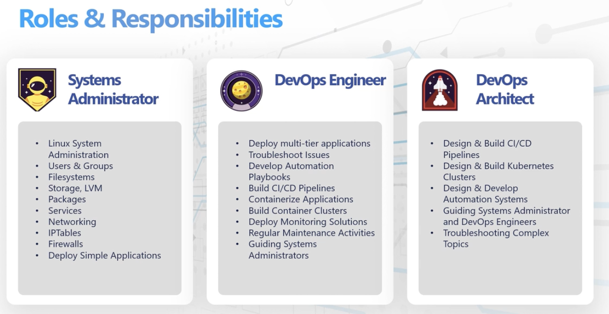

README
======

**KodeKloud Engineer** is a development program where real tasks are performed on real systems as part of a fictional company called xFusion Corp.

Tasks that are performed provide skills experience for roles such as Systems Administrator, DevOps Engineer and Architect.

| Systems Administrator       	| Devops Engineer                                    	| Devops Architect                                   	|
|-----------------------------	|----------------------------------------------------	|----------------------------------------------------	|
| Linux System Administration 	| Deploy multi-tier applications Troubleshoot Issues 	| Design & Build Cl/CD Pipelines                     	|
| Users & Groups              	| Develop Automation Playbooks                       	| Design & Build Kubernetes Clusters                 	|
| Filesystems                 	| Build CI/CD Pipelines                              	| Design & Develop Automation Solutions              	|
| Storage, LVM                	| Containerize Applications                          	| Guiding Systems Administrator and DevOps Engineers 	|
| Packages                    	| Build Container Clusters                           	| Troubleshooting Complex Topics                     	|
| Services                    	| Deploy Monitoring Solutions                        	|                                                    	|
| Networking                  	| Regular Maintenance Activities                     	|                                                    	|
| IPTables                    	| Guiding Systems Administrators                     	|                                                    	|
| Firewalls                   	|                                                    	|                                                    	|
| Deploy Simple Applications  	|                                                    	|                                                    	|

<!--  -->

---

| Task # | Title                                               | Description                                                       | Tags                        |
|:------:|-----------------------------------------------------|-------------------------------------------------------------------|-----------------------------|
|    1   | [Linux File Permissions](linux/linux-file-permissions.md) | SSH into App Serever to change file permissions to be executable. | Linux SSH File Permissions  |

