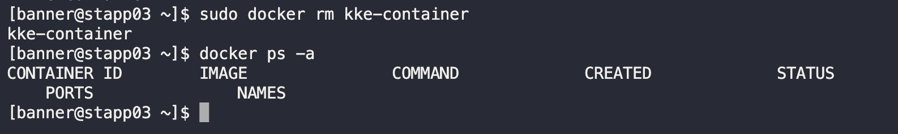

# Delete Docker Container

One of the Nautilus project developers created a container on `App Server 3`. This container was created for testing only and now we need to delete it. Accomplish this task as per details given below:

Delete a container named `kke-container`, its running on `App Server 3` in Stratos DC.

---

## SSH into App Server 3

```bash
ssh banner@172.16.238.12
```

## Stop Container

```bash
sudo docker stop kke-container
```

## Remove Container

```bash
sudo docker rm kke-container
```



---
CONGRATULATIONS!!!!
You have successfully completed the challenge.Results have been saved. Ref ID:6481f7005aecb08e6658f91c