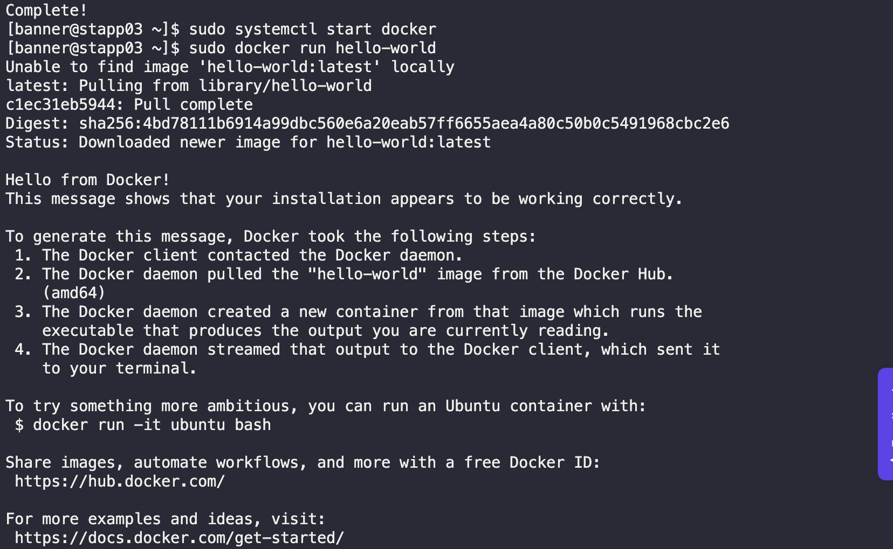

# Install Docker Package

Last week the Nautilus DevOps team met with the application development team and decided to containerize several of their applications. The DevOps team wants to do some testing per the following:

1. Install `docker-ce` and `docker-compose` packages on `App Server 3`.

2. Start `docker` service.

---

## Solution

### SSH into App Server 3

```bash
ssh banner@172.16.238.12
```

### Set up the repository
Install the yum-utils package (which provides the yum-config-manager utility) and set up the repository

```bash
sudo yum install -y yum-utils
sudo yum-config-manager --add-repo https://download.docker.com/linux/centos/docker-ce.repo
```

### Install Docker Engine
Install Docker Engine, containerd, and Docker Compose:

`sudo yum install docker-ce docker-ce-cli containerd.io docker-buildx-plugin docker-compose-plugin`

### Run Docker

```bash
sudo systemctl start docker
sudo docker run hello-world
```



#### Reference
[https://docs.docker.com/engine/install/centos/#set-up-the-repository](Docker)