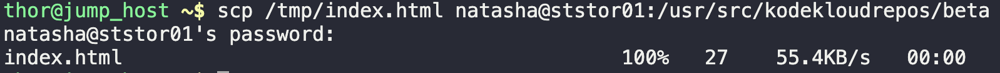
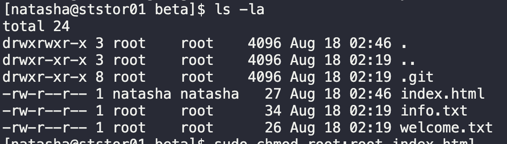

# Repository Update

The Nautilus development team started with new project development. They have created different Git repositories to manage respective project's source code. One of the repositories `/opt/beta.git` was created recently. The team has given us a sample `index.html` file that is currently present on `jump host` under `/tmp` directory. The repository has been cloned at `/usr/src/kodekloudrepos` on `storage server` in `Stratos DC`.

Copy sample `index.html` file from `jump host` to `storage server` under cloned repository at `/usr/src/kodekloudrepos/beta`, further `add/commit` the file and push to the `master` branch.

1. Copy file to storage server
   `scp /tmp/index.html natasha@ststor01:/usr/src/kodekloudrepos/beta`
   Could not execute command.
2. SSH into storage server as natasha
   `ssh natasha@ststor01`
3. Change directory permissions on storage server
   `sudo chmod 777 /usr/src/kodekloudrepos/beta`
4. Execute SCP from item #1
   
5. SSH into storage server
6. Change into directory 
   `cd /usr/src/kodekloudrepos/beta`
7. Execute git commands
   - `git status` shows `fatal: detected dubious ownership in repository at '/usr/src/kodekloudrepos/beta'
   - `ls -la` shows index.html with natasha as owner
     - 
   - Change file ownership
     - `sudo chown root:root index.html`
   - Change directory ownership to align with otehr files
     - `sudo chmod 755 /usr/src/kodekloudrepos/beta`
   - COMMANDS ABOVE NOT REMOVING WARNING
   - Resorted to git suggestion: `git config --global --add safe.directory /usr/src/kodekloudrepos/beta`
   - Commands prevented natasha from executing commands without sudo.
   - `sudo git commit -m "add index.html file."`
   - `sudo git push`

---

You have successfully completed the challenge.Results have been saved. Ref ID:6407203b741b204d59fbe9cf

