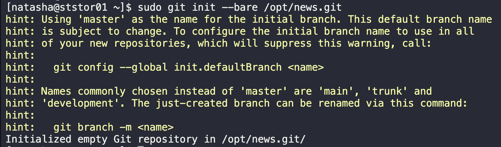

# Git Install and Create Bare Repository

The Nautilus development team shared requirements with the DevOps team regarding new application development.—specifically, they want to set up a Git repository for that project. Create a Git repository on `Storage server` in Stratos DC as per details given below:

1. Install `git` package using `yum` on `Storage server`.
2. After that create a bare repository `/opt/news.git` (make sure to use exact name).

---

1. SSH into Storage Server
   `ssh natasha@ststor01.stratos.xfusioncorp.com`
2. Install git
   `sudo yum install git -y`
3. Install bare repo
   `sudo git init --bare /opt/news.git`

---
You have successfully completed the challenge.Results have been saved. Ref ID:6407203a741b204d59fbe9cd