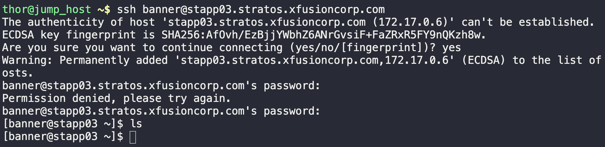
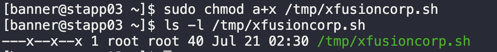
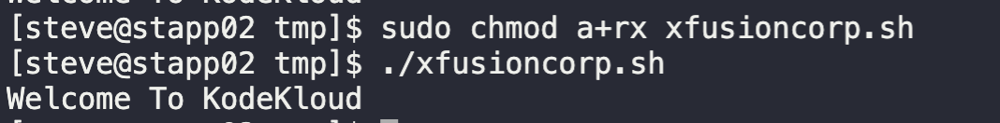

# Linux File Permissions

## July 20, 2023

### Task

There are new requirements to automate a backup process that was performed manually by the `xFusionCorp Industries` system admins team earlier. To automate this task, the team has developed a new bash script `xfusioncorp.sh`. They have already copied the script on all required servers, however they did not make it executable on one the app server i.e `App Server 3` in `Stratos Datacenter`.

Please give executable permissions to `/tmp/xfusioncorp.sh` script on `App Server 3`. Also make sure every user can execute it.

1. Check server details from [documentation](https://kodekloudhub.github.io/kodekloud-engineer/docs/projects/nautilus)

2. SSH into App Server 3
   `ssh banner@stapp03.stratos.xfusioncorp.com`
   

3. Change file permissions
   `sudo chmod a+x /tmp/xfusioncorp.sh`

4. Check file permissions
   `sudo ls -l /tmp/xfusioncorp.sh`
   

The solution above did not work the first time.

An additional check could have been run to check if the file was actually executable.

Received this error: `- 'script' is not executable on App Server 3
FAILED perm.py::test_perm - AssertionError: - 'script' is not executable on A...`

---
### Attempt #2

Proper command should have been `sudo chmod a+rx`

This was done on server 2.

**CONGRATULATIONS!!!!**

You have successfully completed the quiz. Results have been saved. Ref ID:64b9ed9e3a2492ef06942165