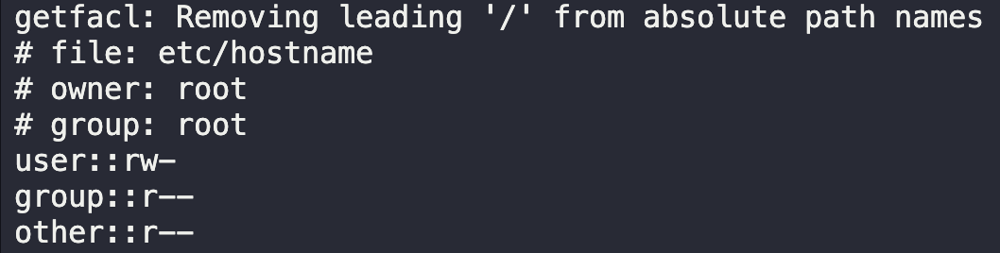

# Access Control List

The `Nautilus` security team performed an audit on all servers present in `Stratos DC`. During the audit some critical data/files were identified which were having the wrong permissions as per security standards. Once the report was shared with the production support team, they started fixing the issues. It has been identified that one of the files named `/etc/hostname` on `Nautilus App 2` server has wrong permissions, so that needs to be fixed and the correct ACLs needs to be set.

1. The user owner and group owner of the file should be `root` user.

2. `Others` must have `read only` permissions on the file.

3. User `anita` must not have any permission on the file.

4. User `eric` should have `read only` permission on the file.

---

1. `ssh steve@stapp02`
2. `ls -la /etc/hostname`
   
3. Change file owners
   `sudo chown root /etc/hostname`
4. Change file group
   `sudo chgrp root /etc/hostname`
5. Change permissions for owner and others
   `sudo chmod 644 /etc/hostname`
6. Check file ACL
   `getfacl /etc/hostname`
   
7. Modify file ACL for anita
   `sudo setfacl -m u:anita:--- /etc/hostname`
8. Modify file ACL for eric
   `sudo setfacl -m u:eric:r-- /etc/hostname`
9. Check file ACL
   