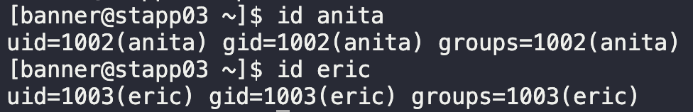

# Cron Schedule to Deny Users

To stick with the security compliances, the Nautilus project team has decided to apply some restrictions on crontab access so that only allowed users can create/update the cron jobs. Limit crontab access to below specified users on `App Server 3`.

Allow crontab access to `anita` user and deny the same to `eric` user.

1. Check user existence
   
2. `echo "anita" | sudo tee -a /etc/cron.allow`
3. `echo "eric" | sudo tee -a /etc/cron.deny`

* Consider restarting cron service.

---

You have successfully completed the challenge.Results have been saved. Ref ID:646889d0c1ff5e7e05478ef1