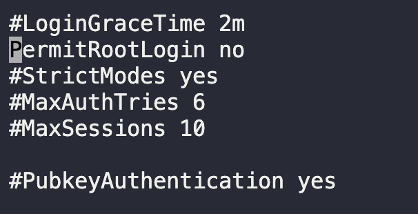

# Disable Root Login

After doing some security audits of servers, `xFusionCorp Industries` security team has implemented some new security policies. One of them is to disable direct root login through SSH.

Disable direct SSH root login on all app servers in `Stratos Datacenter`.

1. Locate `/etc/ssh/sshd_config` and `/etc/sshd_config`
   * Type `:set ic` in Vi to enable non case sensitive search
   * `/<term>` to search for string
2. Change `PermitRootLogin` value to `no`
   
3. Restart ssh service
   `sudo systemctl restart sshd`

Do for all servers.

---

