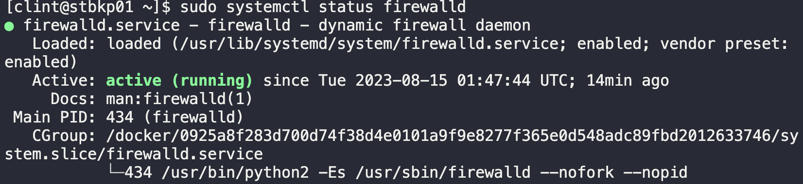
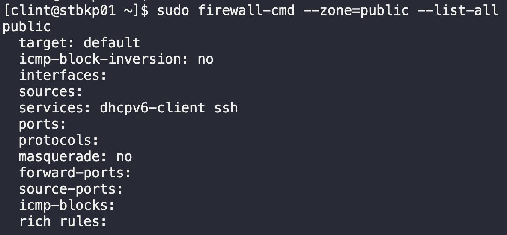
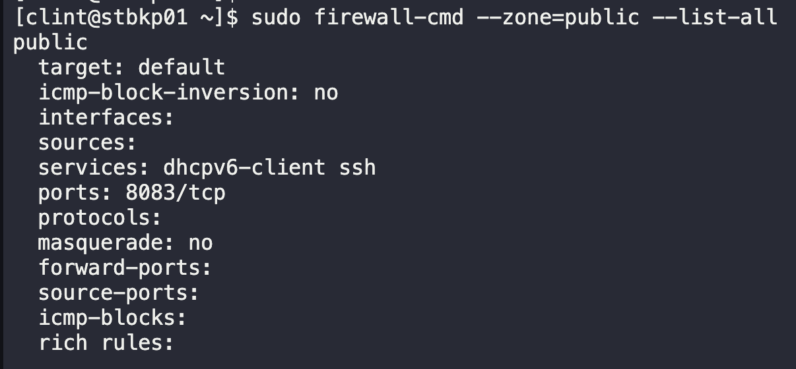

# FirewallD Rules

The `Nautilus` system admins team recently deployed a web UI application for their backup utility running on the `Nautilus backup server` in `Stratos Datacenter`. The application is running on port `8083`. They have `firewalld` installed on that server. The requirements that have come up include the following:

Open all incoming connection on `8083/tcp` port. Zone should be `public`.

1. SSH into backup server
   `ssh clint@stbkp01`
2. Check status of `Firewalld`
   `sudo systemctl status firewalld`
   
3. Add Rule
   ```bash
   sudo firewall-cmd --zone=public --add-port=8083/tcp --permanent
   ```
4. Check rules in public zone
   `sudo firewall-cmd --zone=public --list-all`
   
5. Reload firewalld
   `sudo firewall-cmd --reload`
6. Check rules in public zone
   

