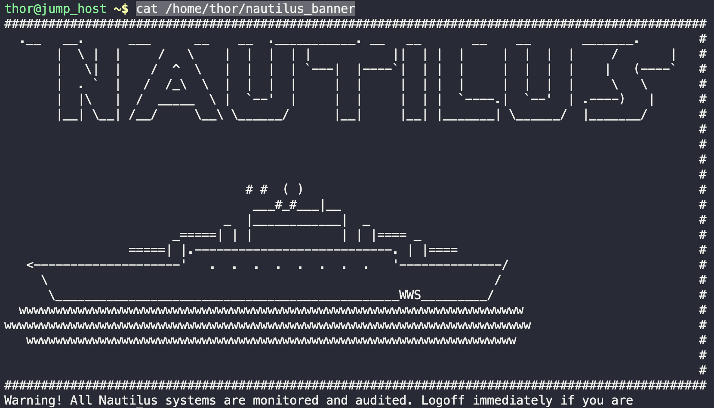

# Update Banner

During the monthly compliance meeting, it was pointed out that several servers in the `Stratos DC` do not have a valid banner. The security team has provided serveral approved templates which should be applied to the servers to maintain compliance. These will be displayed to the user upon a successful login.

Update the `message of the day` on all application and db servers for `Nautilus`. Make use of the approved template located at `/home/thor/nautilus_banner` on jump host

1. Check banner
   `cat /home/thor/nautilus_banner`
   
2. Copy banner to app servers
   ```bash
   scp /home/thor/nautilus_banner tony@stapp01:/tmp
   scp /home/thor/nautilus_banner steve@stapp02:/tmp  
   scp /home/thor/nautilus_banner banner@stapp03:/tmp
   scp /home/thor/nautilus_banner peter@stdb01:/tmp
   ```
3. SSH into each server and update MOTD
   ```bash
    ssh tony@stapp01 
    sudo cp /tmp/nautilus_banner /etc/motd

    ssh steve@stapp02
    sudo cp /tmp/nautilus_banner /etc/motd

    ssh banner@stapp03
    sudo cp /tmp/nautilus_banner /etc/motd 

    ssh peter@stdb01
    sudo cp /tmp/nautilus_banner /etc/motd
   ```
4. Check MOTD
   `cat /etc/motd`

---
You have successfully completed the challenge.Results have been saved. Ref ID:64072025741b204d59fbe9b0

