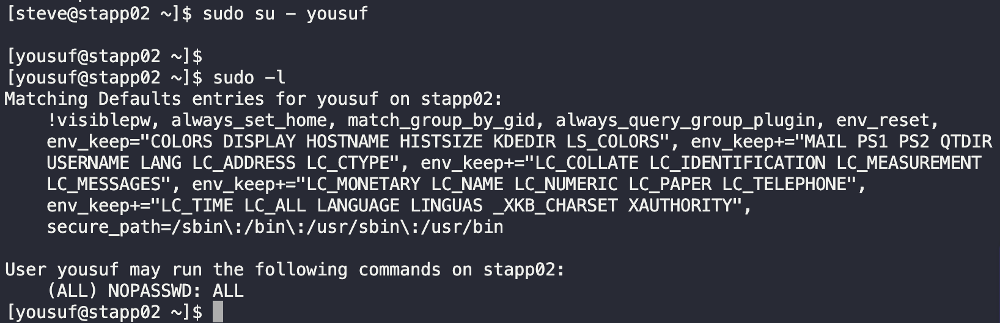

# Linux Configure sudo

We have some users on all app servers in `Stratos Datacenter`. Some of them have been assigned some new roles and responsibilities, therefore their users need to be upgraded with sudo access so that they can perform admin level tasks.

a. Provide sudo access to user `yousuf` on all app servers.

b. Make sure you have set up password-less sudo for the user.

---

1. SSH into all app servers
   ```bash
    ssh tony@stapp01
    ssh steve@stapp02
    ssh banner@stapp03
   ```

2. Edit Sudoers file
   `sudo visudo`

3. Add line
   `yousuf ALL=(ALL) NOPASSWD: ALL`

4. Login as `yousuf` and sudo a command
   `sudo su - yousuf`
   `sudo -l`

   

---

CONGRATULATIONS!!!!
You have successfully completed the challenge.Results have been saved. Ref ID:64072022741b204d59fbe9ad

