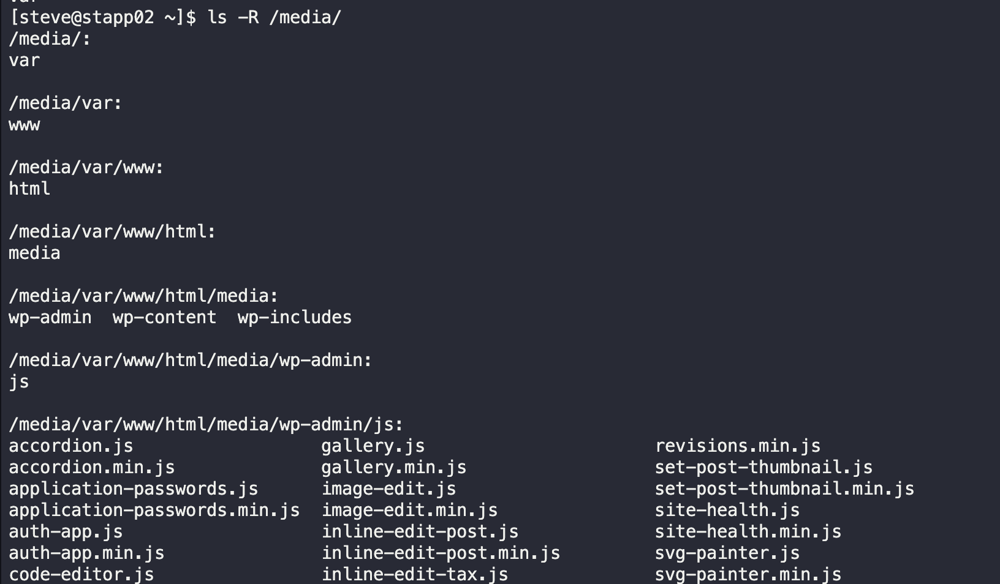

# Find Command

During a routine security audit, the team identified an issue on the Nautilus App Server. Some malicious content was identified within the website code. After digging into the issue they found that there might be more infected files. Before doing a cleanup they would like to find all similar files and copy them to a safe location for further investigation. Accomplish the task as per the following requirements:

a. On `App Server 2` at location `/var/www/html/media` find out all files (not directories) having `.js` extension.

b. Copy all those files along with their `parent directory structure` to location `/media` on same server.

c. Please make sure not to copy the entire `/var/www/html/media` directory content.

---

1. SSH into App Server 2
   `ssh steve@172.16.238.11`

2. Find all JS files, copy to `/media` and keep directory structure
   `find /var/www/html/media -type f -name "*.js" -exec cp --parents {} /media \;`

3. Verify
   `ls -R /media`

---
You have successfully completed the challenge.Results have been saved. Ref ID:6407201e741b204d59fbe9a7