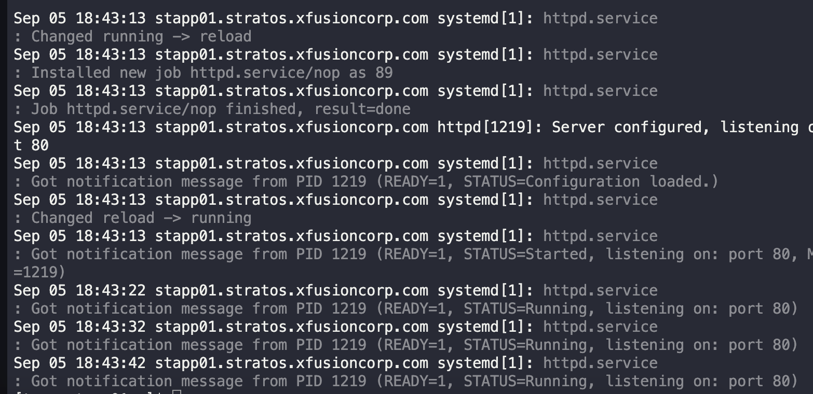

# Linux Services

As per details shared by the development team, the new application release has some dependencies on the back end. There are some packages/services that need to be installed on all app servers under `Stratos Datacenter`. As per requirements please perform the following steps:

a. Install `httpd` package on all the application servers.

b. Once installed, make sure it is enabled to start during boot.

---

1. SSH into app servers
   `ssh tony@stapp01`

2. Install `httpd`
   `sudo yum install httpd -y`

3. Enable and start `httpd`
   `sudo systemctl enable httpd && sudo systemctl start httpd`

4. Check running
   `sudo systemctl status httpd`
   

---
You have successfully completed the challenge.Results have been saved. Ref ID:6407201f741b204d59fbe9a9