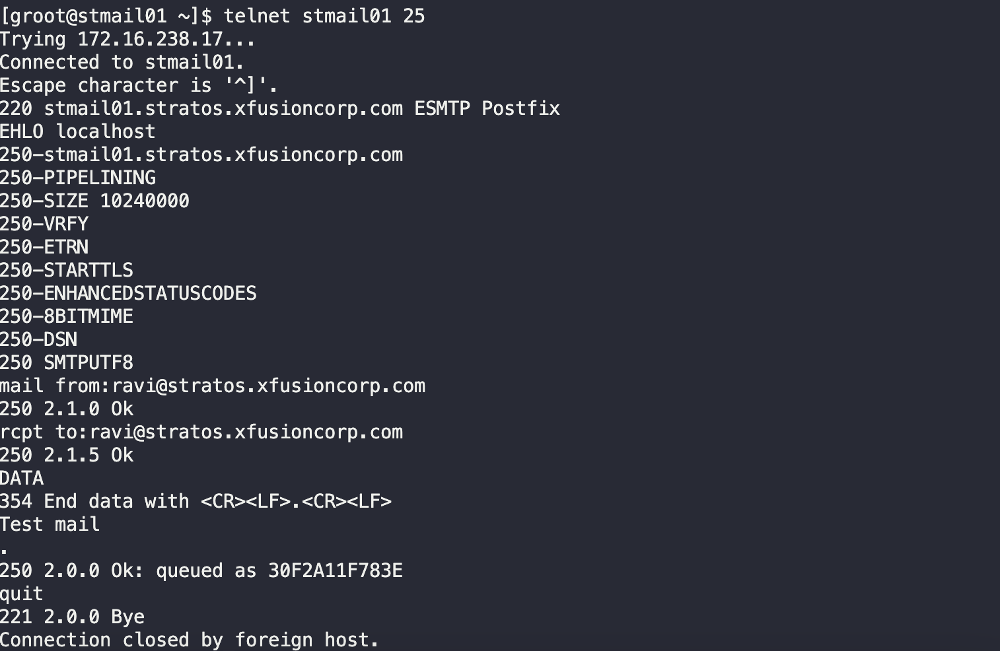
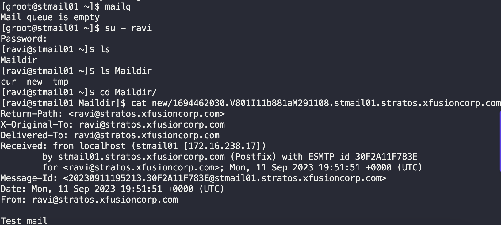
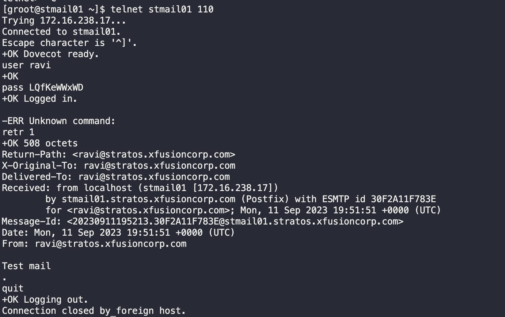
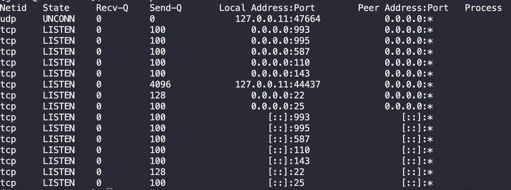

# Postfix Mail Server

`xFusionCorp Industries` has planned to set up a common email server in `Stork DC`. After several meetings and recommendations they have decided to use `postfix` as their `mail transfer agent` and `dovecot` as an `IMAP/POP3` server. We would like you to perform the following steps:

1. Install and configure `postfix` on `Stork DC` mail server.

2. Create an email account `ravi@stratos.xfusioncorp.com` identified by `LQfKeWWxWD`.

3. Set its mail directory to `/home/mark/Maildir`.

4. Install and configure `dovecot` on the same server.

---


1. SSH into Mail Server (Stork DC)
   `ssh groot@stmail01.stratos.xfusioncorp.com`

2. Install postfix
   `sudo yum install postfix -y`

   Note:
   `Postfix` is an open-source mail transfer agent (MTA) that handles the routing and delivery of email messages on Unix-like systems. 
   
   Known for its security features, high-performance capabilities, and robust reliability, making it a popular choice for email infrastructure. 
   
   Offers flexibility in configuration, making it suitable for a wide range of email setups, and it is compatible with standard email protocols, ensuring interoperability with various email clients and servers.

3. Edit `/etc/postfix/main.cf`
   `sudo vim /etc/postfix/main.cf`
   ```
   #find values in file and change/add
   myhostname = stmail01.stratos.xfusioncorp.com
   mydomain = stratos.xfusioncorp.com
   myorigin = $mydomain
   inet_interfaces = all
   #inet_interfaces localhost
   mydestination = $myhostname, localhost.$mydomain, localhost, $mydomain
   mynetworks = 172.16.238.0/24, 127.0.0.0/8
   #172.16.238.0/24 is xFusion network
   home_mailbox = Maildir/
   ```
4. Start `postfix`
   `sudo systemctl start postfix` && `sudo systemctl status postfix`

5. Add user `ravi` and set password `LQfKeWWxWD`
   ```bash
    sudo useradd ravi
    sudo passwd ravi 
   ```
6. Test mail service
   ```
   telnet stmail01 25
   mail from:ravi@stratos.xfusioncorp.com
   rcpt to:ravi@stratos.xfusioncorp.com
   DATA
   Test mail 
   ```
   

   `mailq`
   `su - ravi`
   `cd Maildir/`
   `cat new/`

   


7. Install `dovecot`
   `sudo yum install dovecot -y`

8. Edit `dovecot` config
   `sudo vim /etc/dovecot/dovecot.conf`
   ```yaml
    protocols = imap pop3 lmtp
    ```

   `sudo vim /etc/dovecot/conf.d/10-mail.conf`
   `mail_location = maildir:~/Maildir`

   `sudo vim /etc/dovecot/conf.d/10-auth.conf`
   `disable_plaintext_auth = yes`
   `auth_mechanisms = plain login`

   `sudo vim /etc/dovecot/conf.d/10-master.conf`
   ```
   unix_listener auth-userdb {
    #mode = 0666
    user = postfix
    group = postfix
   }
   ```

   Note:
   
   `Dovecot` is an open-source email server software that provides both the Internet Message Access Protocol (IMAP) and the Post Office Protocol (POP3) for managing email messages on a mail server.

9.  Start `dovecot` and enable at boot
   `sudo systemctl start dovecot`
   `sudo systemctl enable dovecot`

10. Verify
    ```bash 
    telnet stmail01 110
    user ravi
    pass LQfKeWWxWD
    retr 1
    quit

    sudo yum install iproute
    ss -tlnup
    ```
    
    

Credits to Chin Dwin Thar Vlog for the working solution.