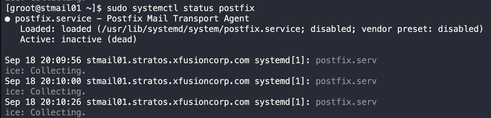
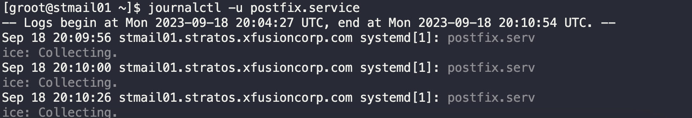
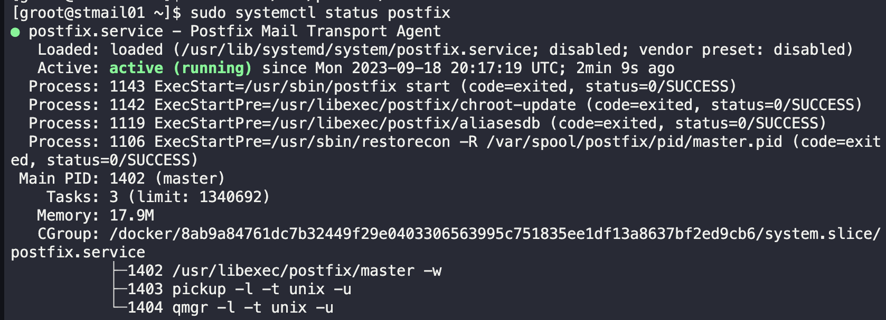

# Postfix Troubleshooting

Some users of the monitoring app have reported issues with `xFusionCorp Industries` mail server. They have a mail server in `Stork DC `where they are using `postfix` mail transfer agent. `Postfix` service seems to fail. Try to identify the root cause and fix it.

1. SSH into Mail Server
   `ssh groot@stmail01`
2. Check status of `postfix` service
   `systemctl status postfix.service`
   
3. Check logs
   `journalctl -u postfix.service`
   
4. Check postfix using built in checker
   `sudo postfix check`
   
   Above shows indication of error regarding local interfaces with parameter `inet_interfaces`
5. Comment `inet_interfaces=localhost` in `/etc/postfix/main.cf`
   `sudo vim /etc/postfix/main.cf`
   
6. Check status
   `sudo systemctl status postfix`
   