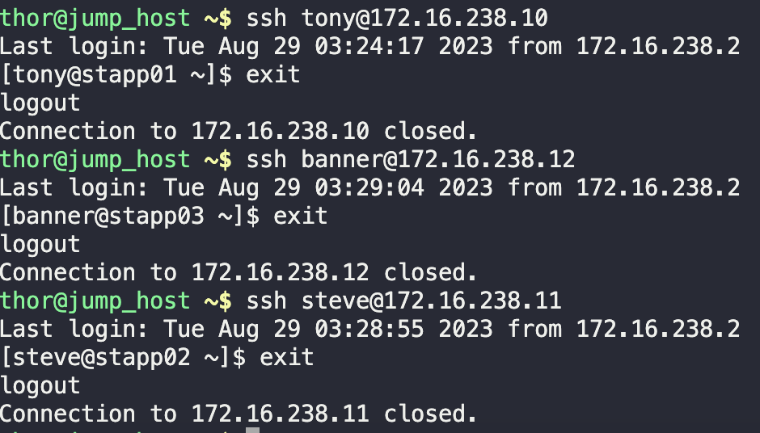

# SSH Authentication

The system admins team of `xFusionCorp Industries` has set up some scripts on `jump host` that run on regular intervals and perform operations on all app servers in `Stratos Datacenter`. To make these scripts work properly we need to make sure the `thor` user on jump host has password-less SSH access to all app servers through their respective sudo users (i.e `tony` for app server 1). Based on the requirements, perform the following:

Set up a password-less authentication from user `thor` on jump host to all app servers through their respective sudo users.

1. Generate SSH Key Pair
   `ssh-keygen`
   This generates a private and a public key.

   Setting a pass phrase for the SSH key will depend on the scenario. Setting a pass phrase will be required and stand in place of the remote server password.

   In this case, it is assumed that the scenario does not want a password whenever SSH is done into an app server.

2. Copy keypairs in to each app server.
   ```bash
    ssh-copy-id -i ~/.ssh/id_rsa.pub tony@172.16.238.10
    ssh-copy-id -i ~/.ssh/id_rsa.pub steve@172.16.238.11
    ssh-copy-id -i ~/.ssh/id_rsa.pub banner@172.16.238.12
   ```

3. Test SSH
   `ssh tony@172.16.238.10`
   

---
You have successfully completed the challenge.Results have been saved. Ref ID:6407200c741b204d59fbe98f