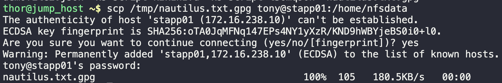
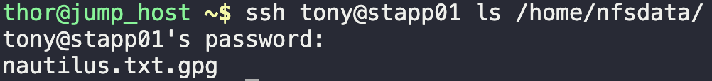

# Remote Copy

One of the `Nautilus` developers has copied confidential data on the jump host in `Stratos DC`. That data must be copied to one of the app servers. Because developers do not have access to app servers, they asked the system admins team to accomplish the task for them.

Copy `/tmp/nautilus.txt.gpg` file from jump server to `App Server 1` at location `/home/nfsdata`.

1. `scp /tmp/nautilus.txt.gpg tony@stapp01:/home/nfsdata`
   
2. `ssh tony@stapp01 ls /home/nfsdata/`
   

---

You have successfully completed the challenge.Results have been saved. Ref ID:64072006741b204d59fbe986