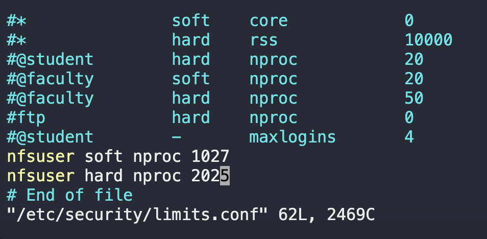

# Resource Limits

On our `Storage` server in `Stratos Datacenter` we are having some issues where `nfsuser` user is holding hundred of processes, which is degrading the performance of the server. Therefore, we have a requirement to limit its maximum processes. Please set its maximum process limits as below:

a. soft limit = `1027`

b. hard_limit = `2027`

1. Edit the `limits.conf` file and add the limits.
   `sudo vim /etc/security/limits.conf`

   

2. Check current limits
   

**Notes**
Cannot reboot server and cannot login as `nfsuser` but answer was accepted by system.
