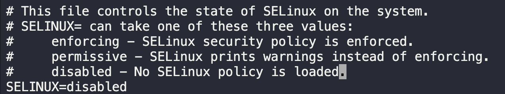

# Selinux Installation

The xFusionCorp Industries security team recently did a security audit of their infrastructure and came up with ideas to improve the application and server security. They decided to use SElinux for an additional security layer. They are still planning how they will implement it; however, they have decided to start testing with app servers, so based on the recommendations they have the following requirements:

Install the required packages of SElinux on `App server 1` in `Stratos Datacenter` and disable it permanently for now; it will be enabled after making some required configuration changes on this host. Don't worry about rebooting the server as there is already a reboot scheduled for tonight's maintenance window. Also ignore the status of SElinux command line right now; the final status after reboot should be `disabled`.

1. SSH into app server 1.
2. Install SELinux Packages
   `sudo yum install policycoreutils selinux-policy selinux-policy-targeted libselinux-utils setroubleshoot-server setools setools-console mcstrans -y`
3. Edit config file and disable `SELINUX=`
   `sudo vi /etc/selinux/config`
   
4. Check status of SELinux
   `getenforce`
   

---

You have successfully completed the challenge.Results have been saved. Ref ID:64072003741b204d59fbe982
