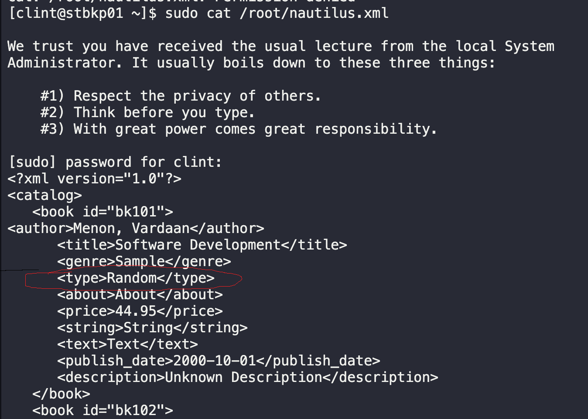
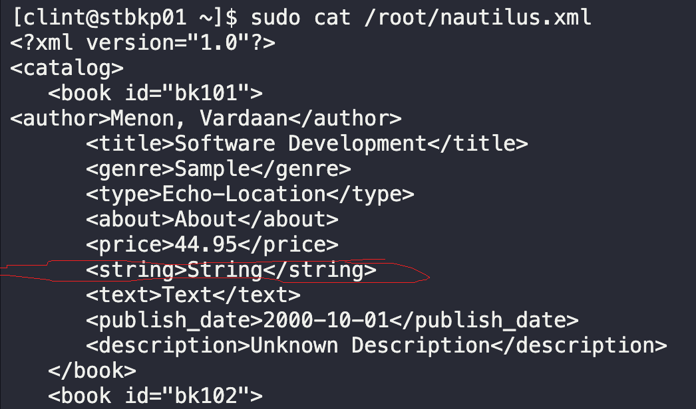

# String Substitute

The backup server in the `Stratos DC` contains several template XML files used by the Nautilus application. However, these template XML files must be populated with valid data before they can be used. One of the daily tasks of a system admin working in the xFusionCorp industries is to apply string and file manipulation commands!

Replace all occurances of the string `Random` to `Echo-Location` on the XML file `/root/nautilus.xml` located in the backup server.

1. `ssh clint@stbkp01`
2. `sudo cat /root/nautilus.xml`
   
3. `sudo sed -i 's/Random/Echo-Location/g' /root/nautilus.xml`
   

## Notes

**Would have been good practice to create a backup first.**

`sed`: stream editor
`i`: edit file directly
`/g`: global substitution

---
You have successfully completed the challenge.Results have been saved. Ref ID:64072004741b204d59fbe984