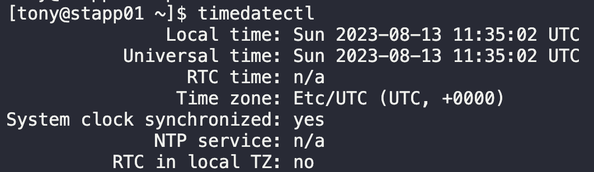
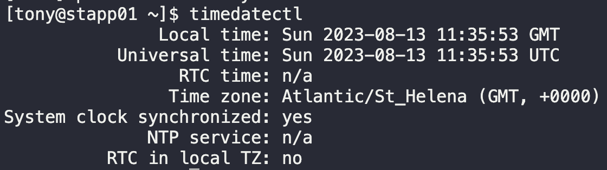

# Linux Timezone Settings

During the daily standup, it was pointed out that the timezone across `Nautilus Application Servers` in `Stratos Datacenter` doesn't match with that of the local datacenter's timezone, which is `Atlantic/St_Helena`.

Correct the mismatch.

1. `timedatectl`
   
2. `sudo timedatectl set-timezone Atlantic/St_Helena`
   
3. Run `timedatectl` again

Repeat for all servers.

---

You have successfully completed the challenge.Results have been saved. Ref ID:64072003741b204d59fbe983