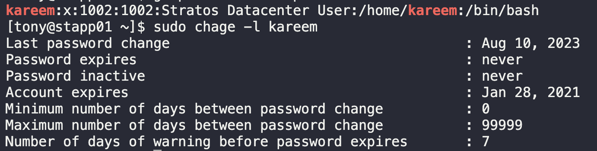

# Linux User Expiry

A developer named kareem has been assigned `Nautilus` project temporarily as a backup resource. As a temporary resource for this project, we need a temporary user for kareem. It’s a good idea to create a user with an expiration date so that the user won't be able to access servers beyond that point.

Therefore, create a user named `kareem` on the `App Server 1` in `Stratos Datacenter`. Set `expiry date` to `2021-01-28`. Make sure the user is created as per standard and is in lowercase.

1. SSH into App Server 1
   `ssh tony@172.16.238.10`

2. Add user with appropriate options.
   * `-m` for user directory
   * `-e` expiry
   * `-c` comment for purpose
  
   `sudo useradd -m -e 2021-01-28 -c "Stratos Datacenter User" kareem`

3. Verify user expiry
   `sudo chage -l kareem`
   